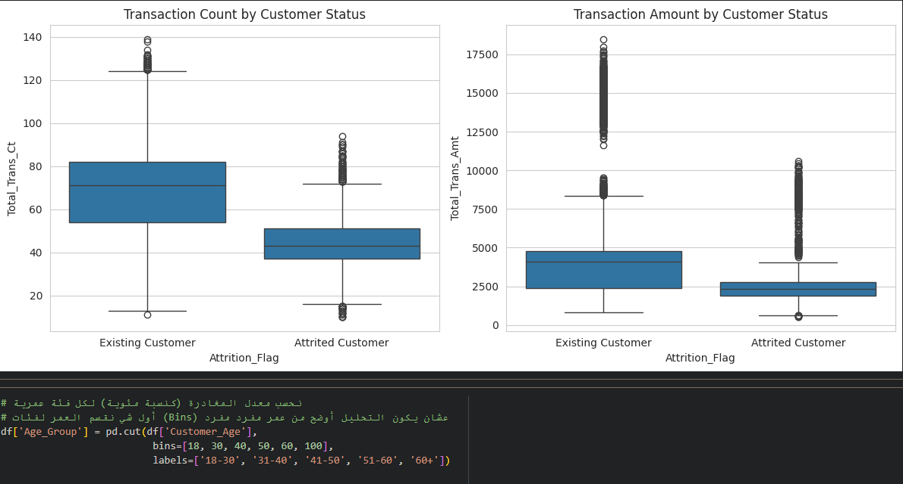
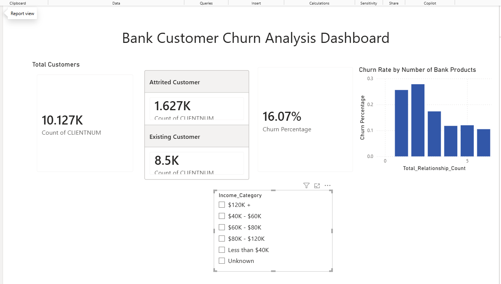

# Bank Customer Churn & Fraud Analysis

An end-to-end data analysis project exploring **customer attrition (churn)** and **transaction fraud patterns** at a retail bank, using **Python** for data cleaning and exploratory analysis, and **Power BI** for an interactive dashboard.

## 📌 Project Overview

Banks lose significant revenue when customers close their accounts. This project analyzes real customer data to answer:
- What behavioral patterns predict customer churn?
- Which customer segments are most at risk?
- What transaction patterns indicate fraud?
- Is there a relationship between fraud exposure and customer churn?

## 🗂️ Data Sources

| File | Source | Description |
|---|---|---|
| `1_bank_customers_churn_dataset.csv` | **Real data** — public dataset (Kaggle, "Credit Card Customers") | 10,127 customers with demographic and behavioral attributes |
| `2_fraud_transactions_dataset.csv` | **Synthetic data** — generated for this project | 31,201 simulated transactions linked to real customer IDs, modeled on realistic fraud patterns |

> ⚠️ **Note on data honesty:** The fraud dataset is synthetic. Real, transaction-level fraud data is either extremely large (150MB+) or inaccessible for privacy/security reasons. It was generated with realistic risk logic (merchant category, foreign transactions, time of day, distance from home) to demonstrate fraud analysis skills without compromising real data.

## 🛠️ Tools & Skills Used

- **Python** (pandas, matplotlib, seaborn) — data cleaning, exploratory data analysis (EDA)
- **Google Colab** — cloud-based analysis environment
- **Power BI** — interactive dashboard with DAX measures, relationships, custom theming, and slicers
- **Statistical testing** (Chi-square test) — validating significance of findings

## 🔍 Key Findings

1. **Overall churn rate: 16.1%** of customers (1,627 out of 10,127)
2. **Transaction activity is the strongest churn signal** — churned customers transacted 35% less frequently and spent 33% less than retained customers, suggesting a gradual "wallet share erosion" before account closure
3. **Number of banking products is the single strongest predictor** — customers with only 1-2 products churn at ~26-28%, compared to ~10-12% for customers with 5-6 products
4. **Months of inactivity correlates strongly with churn** — customers with 0 inactive months show a notably different churn pattern than those with extended inactivity periods
5. **Demographic factors (age, income) show weaker, non-linear effects** — income shows a U-shaped relationship with churn (both low and high income segments churn more than the middle tier)
6. **93% of customers hold the entry-level "Blue" card**, with Silver, Gold, and Platinum making up a small minority — explaining why card-tier-based churn differences are statistically unreliable (small sample sizes)
7. **No reliable link found between fraud exposure and churn** in this dataset — an honest negative finding, flagged with appropriate statistical caveats (see analysis notebook)

## 📈 Exploratory Analysis (Python)



Boxplot comparison showing churned customers had significantly lower transaction counts and amounts than retained customers — the strongest behavioral signal identified in this analysis.

## 📊 Interactive Dashboard (Power BI)



The Power BI dashboard features a custom sidebar layout with a navy/gold theme and includes:
- **KPI cards** — total customers, churn rate, and a breakdown of attrited vs. existing customers
- **Churn Rate by Number of Bank Products** — the strongest predictor identified in the analysis
- **Churn Rate by Income Category** — showing the non-linear (U-shaped) relationship
- **Churn Rate by Months of Inactivity** — an early-warning behavioral signal
- **Customer Distribution by Card Type** (donut chart) — showing portfolio composition
- **Dual slicers** (Income Category, Card Category) for dynamic, cross-filtered exploration

## 💡 Business Recommendations

- **Cross-sell additional products** to single-product customers — the strongest lever to reduce churn
- **Monitor extended inactivity periods** as an early warning signal for proactive retention outreach
- **Track declining transaction activity**, not just customer complaints, as a churn indicator

## 📁 Repository Structure

```
├── 1_bank_customers_churn_dataset.csv   # Real customer data
├── 2_fraud_transactions_dataset.csv      # Synthetic transaction data
├── bank_project_analysis.ipynb           # Full Python analysis notebook
├── bank_project_final.pbix               # Power BI dashboard file
├── power_bi_dashboard.png                # Dashboard preview image
├── python_eda_boxplot.png                # EDA boxplot preview image
└── README.md
```

## 🚀 How to Explore

1. Open `bank_project_analysis.ipynb` directly on GitHub to see the full Python analysis (code, output, and charts) — no setup needed
2. Open `bank_project_final.pbix` in [Power BI Desktop](https://powerbi.microsoft.com/desktop) (free) to interact with the dashboard
3. Load the CSV files into a Python/Jupyter environment to reproduce the analysis yourself

---
*This project was built as a portfolio piece to demonstrate practical data analysis skills in banking/fintech, including data cleaning, statistical reasoning, dashboard design, and business storytelling.*
